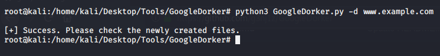

# GoogleDorker
Automate google dorking that search combinations and extract information about a certain website. More updates soon.

# What can it do?
It simply looks for,
1) Directory listing vulnerabilities
2) Configuration files exposed
3) Database files exposed
4) Log files exposed
5) Backup and old files
6) Login pages
7) SQL errors
8) Publicly exposed documents
9) phpinfo()
10) AND OTHER INTERESTING STUFFS

# Install GoogleDorker
```bash
sudo git clone https://github.com/nerrorsec/GoogleDorker
cd GoogleDorker
```

## Usage
<p align="center">
  
</p>

```bash
python3 GoogleDorker.py -d example.com
```

# Found a bug?
- Please feel free to open an [issue](https://github.com/nerrorsec/GoogleDorker/issues)
# Found a security issue?
- Please feel free to report at [huntr.dev](https://huntr.dev/bounties/disclose/?target=https://github.com/nerrorsec/GoogleDorker)

# Find me @
<a href="https://twitter.com/nerrorsec">Twitter</a>

# License under the GNU GPLv3, see (LICENSE)[https://github.com/nerrorsec/GoogleDorker/blob/master/LICENSE] for more information.
